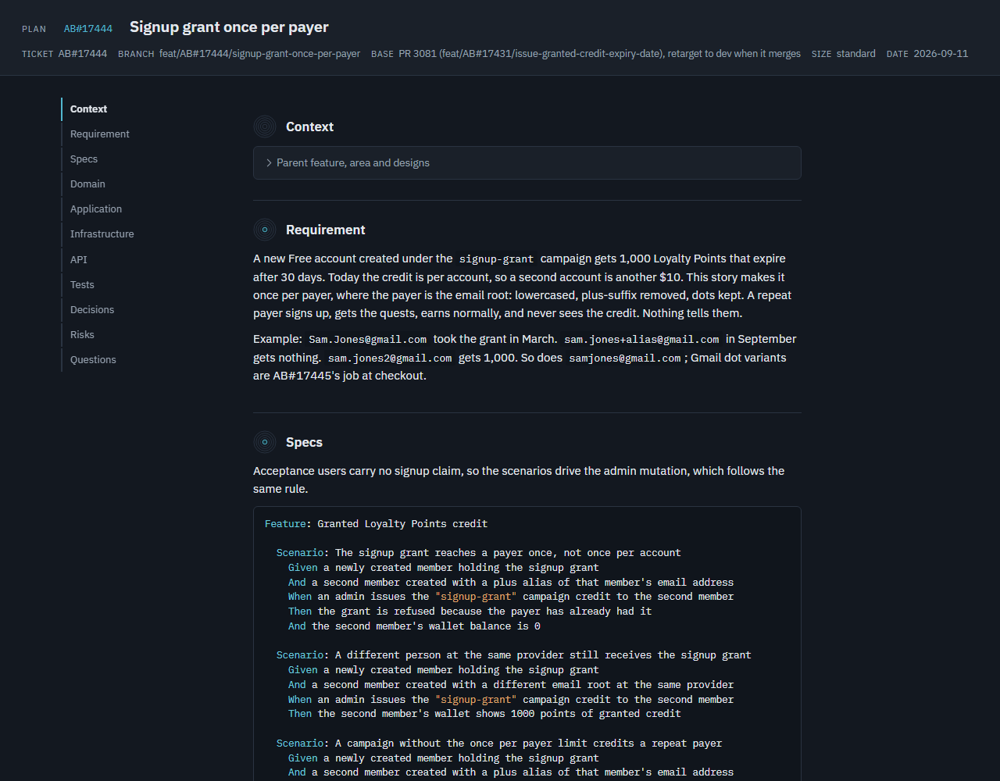
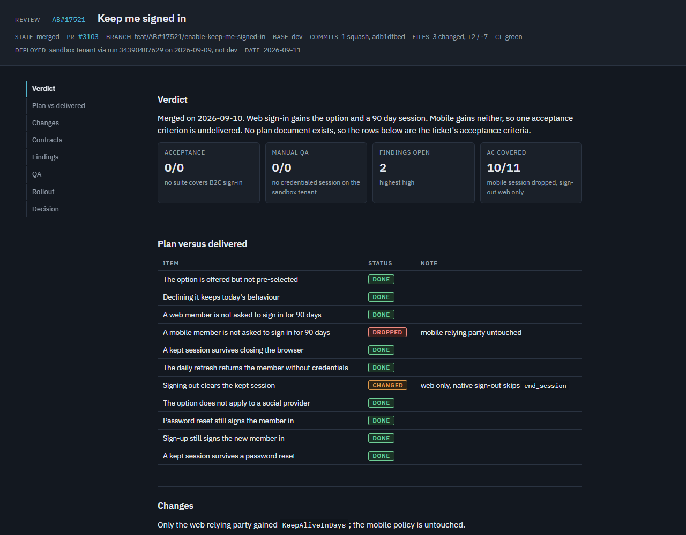

# dotnet-workflow-kit

dotnet-workflow-kit is a budgeted plan-to-review delivery workflow for .NET teams. A
short implementation plan and a short review are each published as a Claude Artifact
page instead of scrollback or a wiki doc, with a word budget enforced by a script so
nobody has to read five thousand words to approve a ticket. One profile file,
`.claude/dotnet-workflow-kit.json`, tells every skill how the team builds (architecture,
testing, stack), how work flows (tracker, source control, QA) and whether the Artifact
tool is even available, so the same skills produce the right shape of page for a Clean
Architecture GraphQL service or a vertical-slice minimal API without any prompt-writing
per project. It is for .NET teams who want a lightweight, repeatable plan and review
step around Claude Code, whether or not they also run Azure Boards, GitHub Issues, or
nothing at all for tracking.

## Install

```
claude plugin marketplace add chrisjainsley/claude-dotnet-workflow-kit
claude plugin install dotnet-workflow-kit@dotnet-workflow-kit
```

Then run `/dotnet-workflow-kit:setup` inside Claude Code, or `python scripts/setup.py`
in a terminal if you would rather answer questions outside the assistant. Either way
the profile lands at `.claude/dotnet-workflow-kit.json` in the project root. Commit
that file so the whole team shares one workflow instead of each person's local guess.

Python 3.11 or later is required to run the scripts. Pillow is optional; without it,
image downscaling in the plan builder is skipped and full-size images are embedded
instead.

## The workflow

The kit walks one ticket through the same stages every time. `/next` runs the stages
below in order and stops at the review page for a decision.

1. **Start the ticket.** `start-ticket` creates a branch from `base_branch`
   using `branch_pattern`, assigns the ticket and moves it to active.
2. **Plan page.** `visual-plan` publishes a plan Artifact ordered from the
   requirement outward through the architecture's layers, ending in an open-questions
   form. Answer the open questions directly on the page; each one is a title, context,
   and a set of recommended and alternative options. When you are done, tell the
   session "answered" and it reads the stored choices back and folds them into the plan
   as settled decisions.
3. **Execute.** Implementation proceeds against the approved plan.
4. **Mega-review.** Runs the profile's reviewers, always `bug-hunt` and
   `conventions`, plus any optional ones the profile turns on, across the branch
   before a PR goes up.
5. **Draft PR.** Opened against `base_branch` following `branch_pattern`.
6. **QA.** Testing runs the way `qa.owner` and `qa.environment` describe; whatever
   evidence comes out of it feeds the review's QA report section.
7. **Review page.** `visual-review` publishes one Artifact that is both the
   code review and the QA report: verdict tiles, a plan-versus-delivered table, a
   diagram of the change, per-service change tables whose files link to their full
   diffs, a findings table, the QA report itself, a persistent rollout checklist, and
   an approve or request-changes decision form.
8. **Hand-off.** On approve, the QA report section is posted wherever `qa.evidence`
   says (a work item, a PR comment, or nowhere at all), and the pipeline continues
   past the checkpoint.

## Running the pipeline unattended with /goal

`/next` runs stage after stage without asking, but it stops at two points that need a
human: the plan page (approve or answer the open questions) and the review page (approve
or request changes). Claude Code's `/goal` command keeps a session working turn after
turn until a condition is met, so the two together take a ticket from start to hand-off
with only those two decisions from you.

1. Start the ticket and set the goal in one go:
   ```
   /dotnet-workflow-kit:start-ticket 1234
   /goal Run /next until it stops at the review checkpoint for ticket 1234 and has printed the review page link. Stop within 3 hours.
   ```
   `/next` then runs the plan, execute, mega-review, draft PR, comment and QA stages.
   After each turn a small evaluator model checks the transcript against the condition
   and starts the next turn until the review link appears, so keep the condition about
   something that shows up in chat, not on the page.
2. When `/next` publishes the plan page it prints the link and waits. Open the page,
   answer the questions or leave the recommended defaults, press Send answers, then
   type `answered`. `/next` reads the answers from the page and carries on; the goal
   keeps it moving.
3. At the review checkpoint the goal is met and clears itself. Open the review page,
   tick the rollout items, choose Approve or Request changes, press Send decision, then
   type `decided`. `/next` reads the decision. Approve runs the hand-off stage; request
   changes returns to execute with your notes and per-finding fix or accept actions.
4. If you want the hand-off to run unattended too, set a second goal after deciding:
   ```
   /goal Run /next until the hand-off stage reports done for ticket 1234.
   ```

Notes that keep this safe:

- Run in auto permission mode for a hands-free session. In manual mode the goal still
  runs, but every unapproved tool call waits for you, which is a slower checkpoint.
- Always put a time or turn bound in the condition. A blocked stage (CI red for a reason
  outside the branch, a merge conflict, a missing profile) makes `/next` stop and say
  why; the bound stops the goal from re-prompting past that.
- One goal per session. `/goal` on its own shows the current one and `/goal clear`
  removes it. `/next status` prints the stage table without running anything.
- With `artifacts` false in the profile there are no pages; answers and the decision are
  given in chat, and the same two goals still apply.

## Skills

### visual-plan

Triggers on "plan this", "visual plan", "plan `<ticket id>`", `/visual-plan`, or
the pipeline reaching the Plan stage. Reads the profile, the ticket through the
tracker adapter, the codebase read-only, and the architecture, stack and testing
adapters for section wording. Produces `plans/<id>-<slug>/plan.md` and `plan.html`,
published as a Claude Artifact (or left as local HTML when `artifacts` is false),
with sections from Context through Open questions and an answerable open-questions
form. **Shipped in v0.1.**

### visual-review

Triggers on "review this", "recap", "qa report", "write up the review",
`/visual-review`, or the pipeline reaching the Review stage. Reads the profile,
the PR and diff through the scm adapter, the approved plan and its stored answers,
mega-review findings from the session, and QA evidence gathered by the user or the
session. Produces `review.md` and `review.html`: verdict tiles, plan versus delivered,
a change diagram, per-service change tables linking every file to its diff, findings,
a QA report, a rollout checklist and a decision form. **Shipped in v0.1.**

### start-ticket

Triggers on "start ticket", "start work on `<id>`", "pick up `<id>`", or
`/start-ticket`. Reads the profile's `tracker` (which adapter parses and fetches the
item), `tracker_project`, `base_branch`, `branch_pattern` and `user`, following
`adapters/tracker/<tracker>.md` to fetch, assign and activate the item. Produces a
branch named from `branch_pattern` off `base_branch`, the item assigned to `user` and
moved to the tracker's active state, the session renamed to the id and slug, and a
hand-off to `visual-plan`. It does not write a pipeline state key itself; `next`
records the `startTicket` stage when it drives this skill. **Shipped in v0.2.**

### qa-report

Has two modes. Default mode triggers on "qa report", "write up the testing", or
"document what we tested" when used outside the review-page flow. Reads the profile's
`qa.evidence` (work item, PR comment, or none), `tracker` or `scm` for the matching
adapter, `testing.acceptance` for naming the automated runner, and `artifacts` for
whether to publish a page. Produces a BDD-format report: one Given/When/Then card per
behaviour tagged Acceptance test or Manual test with Pass, Fail or Blocked and
evidence, a summary table, and a Not covered list, posted to the work item or PR
comment per `qa.evidence` after the user approves it.

Notes mode triggers on "qa notes", "test notes", "notes for QA", or the argument
`notes`. Reads the approved plan's Specs section at `plans/<id>-<slug>/plan.md` when
one exists, else `git diff <base>...HEAD`, plus the profile's `qa.owner`,
`qa.evidence`, `tracker` and `scm` fields for who the notes are for and where they go.
Produces notes covering what changed, how to test it per persona, test data and
accounts, edge cases, out of scope, and environment or feature-flag setup, posted to
the work item or PR comment when `qa.owner` is `qa-team`, printed otherwise.

Both modes post through the same adapter step; neither has scripts or templates of its
own, and neither writes a pipeline state key. **Shipped in v0.2.**

### mega-review

Triggers on "mega review", "full review", "review everything", or "pre-PR check".
Reads the profile's `reviewers` list, `optional.dotnet-claude-kit`, `optional.codex`,
`architecture` (for `adapters/architecture/<value>.md`), `scm`, `base_branch` and
`testing.*`. Two reviewers are always on, `bug-hunt` and `conventions`; `reviewers`
can add `kit` (`dotnet-claude-kit:code-review` and `80-20-review` in Phase 1,
`de-sloppify` in Phase 2, `verification-loop` in Phase 3), `security-scan`,
`convention-learner`, or `code-review-workflow` (only when `optional.roslyn-mcp` is
true); `optional.codex` adds a codex second-opinion reviewer. A reviewer whose skill
or plugin is missing is recorded as `skipped: <reason>` instead of failing the run.
Produces a consolidated findings table, a cleanup summary, a verification result and
a skipped list, and writes the pipeline state file's `megaReview` key as
`{"done": true, "findings": [...], "skipped": [...]}`, which `visual-review`
reads instead of re-running a review. **Shipped in v0.3.**

### next

Triggers on "next", "what's next", "keep going", or "run the pipeline"; `/next
status` prints the table only. Reads the profile end to end: `tracker`, `scm`,
`base_branch`, `branch_pattern`, `qa.owner`, `qa.evidence`, `qa.handoff_label`,
`qa.deploy_label`, `qa.environment`, `testing.tdd`, `pipeline.execute`,
`pipeline.resolve_comments`, `pipeline.qa`, `artifacts`, `reviewers` and
`optional.*`. Produces the nine-stage pipeline run:

0. Start ticket, via `start-ticket`.
1. Plan, via `visual-plan`.
2. Execute, via `pipeline.execute` or by implementing the plan directly.
3. Review, via `mega-review`.
4. Draft PR, against `base_branch` or a stacked parent.
5. Resolve comments, via `pipeline.resolve_comments` or the scm adapter.
6. QA, via `pipeline.qa` or the plan's Specs run manually.
7. Review page, via `visual-review`.
8. Publish and hand off, posting the QA report and moving the item to the tracker's
   QA-ready state.

It writes and reads stage completion at
`~/.claude/dotnet-workflow-kit/pipeline/<slug>.json`, and at the checkpoint after
stage 7 it reads the approve-or-changes decision from the review page rather than
asking in chat. **Shipped in v0.3.**

## Profile reference

All fields live in `.claude/dotnet-workflow-kit.json`. Dotted names below are nested
under their parent object (for example `testing.tdd` is `{"testing": {"tdd": ...}}`).

| Field | Allowed values | Default | What it changes |
|---|---|---|---|
| `user` | free text | `""` (shown as "you") | The name used in plan and review page prose. |
| `architecture` | `clean`, `vertical`, `ddd-clean`, `modular-monolith` | `clean` | The plan's section order and word caps, the review's slice names, and which `adapters/architecture/<value>.md` loads. |
| `testing.tdd` | `strict`, `encouraged`, `none` | `encouraged` | How firmly the plan and review state the TDD expectation. |
| `testing.unit` | `xunit`, `nunit`, `mstest` | `xunit` | The unit test framework named in the Tests section. |
| `testing.integration` | `webapplicationfactory`, `testcontainers`, `none` | `webapplicationfactory` | The integration test style named in Specs and Tests. |
| `testing.acceptance` | `reqnroll`, `specflow`, `none` | `none` | Whether Specs promises a BDD feature file and which runner drives it. |
| `qa.owner` | `qa-team`, `self`, `none` | `self` | Who signs off in the review's QA section; loads `adapters/qa/<value>.md`. |
| `qa.evidence` | `work-item`, `pr-comment`, `none` | `none` | Where the QA report is posted on approve. |
| `qa.handoff_label` | free text | `""` | The PR label that hands a PR to QA, named in Rollout. |
| `qa.deploy_label` | free text | `""` | The PR label that deploys to the QA environment, named in Rollout. |
| `qa.environment` | free text | `"local"` | The environment named throughout the QA report. |
| `tracker` | `azure-boards`, `github-issues`, `jira`, `none` | `none` | How the ticket is fetched; loads `adapters/tracker/<value>.md`, or `adapters/tracker/<value>/README.md` when the adapter is a folder. |
| `tracker_project` | free text | `""` | The project or org identifier passed to tracker commands. |
| `tracker_states.active` | free text | `""` | The tracker state a ticket moves to when work starts. |
| `tracker_states.qa_ready` | free text | `""` | The tracker state a ticket moves to for hand-off to QA. |
| `scm` | `github`, `azure-repos` | `github` | How the PR, base and diff are found; loads `adapters/scm/<value>.md`. |
| `base_branch` | free text | `"main"` | The branch PRs target and diffs compare against. |
| `branch_pattern` | free text, must contain `{slug}` | `"{kind}/{id}-{slug}"` | The branch naming template `start-ticket` uses. |
| `branch_kinds.feature` | any short prefix | `feat` | The `{kind}` value in `branch_pattern` for features. |
| `branch_kinds.bug` | any short prefix | `bug` | The `{kind}` value in `branch_pattern` for bugs. |
| `tracker_states.active` | a state name, or blank | blank | The tracker state start-ticket moves an item to. Blank keeps the adapter's default. |
| `tracker_states.qa_ready` | a state or column name, or blank | blank | The state next moves an item to at hand-off. Blank keeps the adapter's default. |
| `artifacts` | `true`, `false` | `true` | Whether pages publish as Claude Artifacts or open as local HTML with answers taken in chat. |
| `stack.data` | `ef-core`, `dapper`, `cosmos`, `other` | `ef-core` | The data access named in Infrastructure and Contracts sections. |
| `stack.api` | `minimal-api`, `controllers`, `graphql`, `grpc` | `minimal-api` | The API style named in the API and Contracts sections. |
| `stack.messaging` | `masstransit`, `wolverine`, `service-bus`, `none` | `none` | The messaging technology named in Infrastructure and Contracts. |
| `stack.errors` | `result`, `exceptions` | `exceptions` | The error handling convention named in Application and API sections. |
| `stack.local_run` | `aspire`, `docker`, `plain` | `plain` | How the QA stage describes starting the system locally. |
| `pipeline.execute` | any command or slash command, or blank | blank | What `/next` runs at the Execute stage. Blank means it implements the plan directly, tests first when `testing.tdd` is `strict`. |
| `pipeline.resolve_comments` | any command, or blank | blank | What `/next` runs to resolve PR review threads. Blank means the scm adapter's steps. |
| `pipeline.qa` | any command, or blank | blank | What `/next` runs at the QA stage. Blank means the plan's Specs are run by hand per the QA adapter. |
| `reviewers` | `bug-hunt`, `conventions` (always on), plus `kit`, `security-scan`, `convention-learner`, `code-review-workflow` | `[bug-hunt, conventions]` | Which reviewers mega-review runs beyond the two built-ins. |
| `optional` | object with `dotnet-claude-kit`, `codex`, `roslyn-mcp`, each `true`/`false` | all `false` | Whether the companion kit, Codex and a Roslyn MCP server were detected or installed. |
| `schema` | integer | `1` | Internal profile version; setup fills in defaults for anything an older file lacks. |

Two invariants are enforced on every write and every load:

- `qa.evidence` cannot be `work-item` unless `tracker` is something other than `none`.
- `reviewers` always includes `bug-hunt` and `conventions`; they cannot be removed.

## dotnet-claude-kit

Setup recommends the companion `dotnet-claude-kit` plugin and offers to install it
whenever one of your answers needs a skill it provides. The mapping:

| Answer | dotnet-claude-kit skills it needs |
|---|---|
| `architecture: clean` | `clean-architecture` |
| `architecture: ddd-clean` | `clean-architecture`, `ddd` |
| `architecture: vertical` | `vertical-slice` |
| `testing.tdd: strict` | `tdd` |
| `stack.data: ef-core` | `ef-core`, `migration-workflow` |
| `stack.api: minimal-api` | `minimal-api`, `openapi`, `api-versioning` |
| `stack.messaging: masstransit` | `messaging` |
| `stack.messaging: wolverine` | `messaging` |
| `stack.errors: result` | `error-handling` |
| `stack.local_run: aspire` | `aspire` |
| `reviewers: kit` | `code-review`, `80-20-review`, `de-sloppify`, `verification-loop` |
| `reviewers: security-scan` | `security-scan` |
| `reviewers: convention-learner` | `convention-learner` |
| `reviewers: code-review-workflow` | `code-review-workflow` (also needs a Roslyn MCP server) |

The kit runs fine without it. Plan sections still work using only the built-in
adapters; the difference is that the extra `kit`, `security-scan`,
`convention-learner` and `code-review-workflow` reviewers in mega-review are skipped
and reported as such, rather than run.

## Screenshots


The plan page's Context, Specs and Open questions sections with the answer form open.


The review page's verdict tiles, change diagram and decision form.

## Architecture support

`clean`, `ddd-clean` and `modular-monolith` all share the same plan section order and
review slice names (Domain, Application, Infrastructure, API, Tests); the latter two
describe different governance around that same structure. `vertical` has its own
section order (Slice, Persistence, Integration, Endpoint, Tests) and is exercised by
`tests/fixtures/plan-vertical.md` alongside the `clean` fixture.

## Repository layout

```
claude-dotnet-workflow-kit/
├── .claude-plugin/   # plugin.json and marketplace.json
├── assets/           # page.html, the shared plan and review page shell
├── adapters/         # tracker, scm, architecture, qa value files;
│                     # stack/<field>.md holds every value as a section;
│                     # tracker/azure-boards/ is a folder (README.md + fetch_context.py)
├── commands/         # setup.md, the /dotnet-workflow-kit:setup command
├── docs/             # this reference documentation
├── scripts/          # kit_profile.py, setup.py, render.py and check.py (shared by the
│                     # visual-plan and visual-review skills)
├── skills/           # start-ticket, visual-plan, mega-review (see
│                     # skills/mega-review/reviewers/), next, qa-report (report and
│                     # notes modes), visual-review
└── tests/            # pytest fixtures and skill tests
```

## Contributing

Run `pytest` before opening a PR; the profile, setup and skill build scripts are all
covered by fixture-backed tests in `tests/`. Run `claude plugin validate .` to check
the plugin manifest and the command and skill front matter. CI also runs a
private-string gate that scans the diff for internal identifiers, such as an
employer's name, an internal hostname, or a personal email address, that must never
land in this public repository; keep any examples you add generic.

## License

MIT. See [LICENSE](LICENSE). Author: Chris Ainsley.
