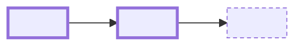

## Verdict
<!-- One or two sentences: ready for QA or not, and the single reason if not. Then the tiles table; every number must agree with the sections below. -->

| Metric | Value | Note |
|---|---|---|
| Acceptance | <pass>/<run> | <suite or feature, environment> |
| Manual QA | <pass>/<run> | <environment> |
| Findings open | <n> | <highest severity> |
| AC covered | <n>/<m> | <delivered in code: done plus changed rows; name what is dropped> |

## Plan versus delivered
<!-- Every spec scenario and decision from the approved plan. Status is done, changed or dropped; one line of reason for anything but done. Deviations from the plan's decisions get their own row. -->

| Item | Status | Note |
|---|---|---|
| <scenario or decision> | done | |

## Changes
<!-- One line at the top for anything the reviewer must not miss: breaking change, backfill, behaviour that differs from the ticket wording. Then one mermaid diagram of the change: nodes are the components touched (grains, handlers, resolvers, policies, tables), edges are the call or data path from the domain outward, a subgraph per service when more than one, changed nodes in class `changed`, untouched neighbours that give context in class `ctx`, about a dozen nodes at most. Then per service: ### ServiceName, a Slice / File / Change table (slices: Domain, Application, Infrastructure, API, Tests; anything else takes the nearest slice, so identity policies, infrastructure as code, workflows and config are Infrastructure). File is the repo-relative path in backticks, or a unique tail of it; the builder links it to that file's full diff, pulled from git and appended collapsed at the end of the section. Then the load-bearing hunks as #### title followed by a ```diff fence. At most eight hunks across the whole review; each under 60 lines. -->



### <ServiceName>
| Slice | File | Change |
|---|---|---|
| Domain | `<repo-relative path>` | <one line> |

#### <hunk title: what this hunk decides>
```diff
- old
+ new
```

## Contracts and coordination
<!-- Only what another team or another PR has to move for. The rows are illustrative: drop the ones that do not apply and add what does (tenants, client apps, feature flags). "None." rows are fine when the reader would otherwise wonder. -->

| Concern | Change | Action |
|---|---|---|
| GraphQL schema | <SDL delta or none> | <snapshot regenerated, FE informed> |
| Events | <new event, topic mapping, centralus mirror> | |
| Storage | <containers, tfvars> | <terraform PR> |
| Config | <App Configuration keys per environment> | |
| Migrations | | |
| Client apps | <web or mobile change this depends on> | |
| Type-name collisions | checked against <services> | |

## Findings
<!-- Code review findings from mega-review and the CLAUDE.md rules check. Status: fixed, accepted (with the reason in Note), or open. Open rows become accept/fix radios in the decision form. -->

| Severity | Location | Finding | Status | Note |
|---|---|---|---|---|
| high | `<path>:<line>` | <one sentence> | fixed | |

## QA report
<!-- Same structure the qa-report command posts to the work item. Environment and date line, then one #### per behaviour verified, tagged Acceptance test or Manual test with Pass, Fail or Blocked, a gherkin fence, an Evidence line, and a Classification line (regression | pre-existing bug | environment issue | not run) for anything but Pass. Unit and integration suites are not QA and do not appear. If nothing was run, open with **No QA run.** and put every criterion under Not covered instead of inventing a Blocked row. End with the summary table and Not covered. -->

**Environment:** <qa environment / local> | **Date:** <YYYY-MM-DD> | **Test users:** <emails>

#### <Scenario title> `Acceptance test` **Pass**
```gherkin
Given <persona and precondition>
When <action>
Then <observed outcome>
```
Evidence: <one line>

| Scenario | Type | Env | Result |
|---|---|---|---|
| | Acceptance | sand | Pass |

**Not covered:** <behaviour related to the change that was not tested and why>

## Rollout
<!-- Ordered checklist, up to eight items, ticks persist on the page. Terraform first, config flags, stacked PR order, migrations, labels, hand-off. -->

- [ ] <step>

## Decision
<!-- Your recommendation in one or two sentences. The approve / request-changes form is added by the builder. -->
