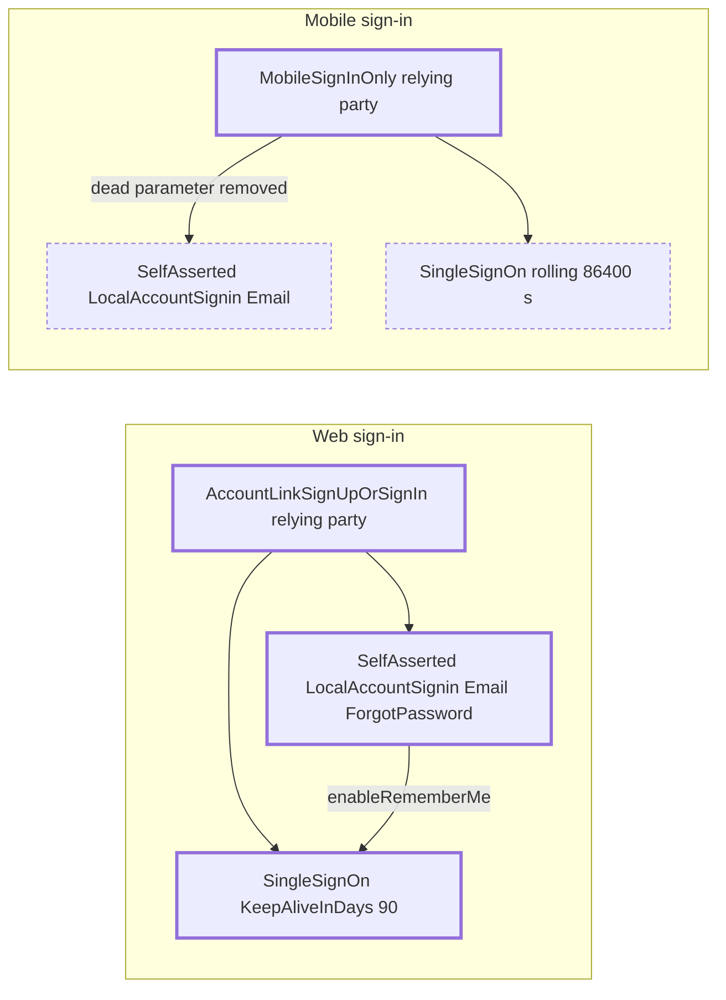

## Verdict

Merged on 2026-09-10. Web sign-in gains the option and a 90 day session. Mobile gains neither, so one acceptance criterion is undelivered. No plan document exists, so the rows below are the ticket's acceptance criteria.

| Metric | Value | Note |
|---|---|---|
| Acceptance | 0/0 | no suite covers B2C sign-in |
| Manual QA | 0/0 | no credentialed session on the sandbox tenant |
| Findings open | 2 | highest high |
| AC covered | 10/11 | mobile session dropped, sign-out web only |

## Plan versus delivered

| Item | Status | Note |
|---|---|---|
| The option is offered but not pre-selected | done | |
| Declining it keeps today's behaviour | done | |
| A web member is not asked to sign in for 90 days | done | |
| A mobile member is not asked to sign in for 90 days | dropped | mobile relying party untouched |
| A kept session survives closing the browser | done | |
| The daily refresh returns the member without credentials | done | |
| Signing out clears the kept session | changed | web only, native sign-out skips `end_session` |
| The option does not apply to a social provider | done | |
| Password reset still signs the member in | done | |
| Sign-up still signs the new member in | done | |
| A kept session survives a password reset | done | |

## Changes

Only the web relying party gained `KeepAliveInDays`; the mobile policy is untouched.



### User Service, Azure B2C policies

| Slice | File | Change |
|---|---|---|
| Infrastructure | `Acme.App.Services.User.AzureB2C/Policies/B2C_1A_SIGNUP_SIGNIN.xml` | web relying party keeps the tenant SSO cookie for 90 days |
| Infrastructure | `Acme.App.Services.User.AzureB2C/Policies/B2C_1A_ACCOUNTLINK_EXTENSIONS.xml` | web sign-in profile renders the option |
| Infrastructure | `Acme.App.Services.User.AzureB2C/Policies/B2C_1A_MOBILE_SIGNIN.xml` | dead `setting.showKeepMeSignedIn` parameter removed |
| Tests | none | B2C policy XML has no test host in this repo |

B2C caps `SessionExpiryInSeconds` at 86400 and ignores `refresh_token_lifetime_secs` for SPAs, so `KeepAliveInDays` is the only lever past 24 hours.

#### The web relying party trades a dead parameter for the real session lever

```diff
     <UserJourneyBehaviors>
-      <SingleSignOn Scope="Tenant" />
-      <ContentDefinitionParameters>
-        <Parameter Name="setting.showKeepMeSignedIn">true</Parameter>
-      </ContentDefinitionParameters>
+      <SingleSignOn Scope="Tenant" KeepAliveInDays="90" />
       <ScriptExecution>Allow</ScriptExecution>
     </UserJourneyBehaviors>
```

#### The box is enabled on the one profile the web journey calls

```diff
         <TechnicalProfile Id="SelfAsserted-LocalAccountSignin-Email-ForgotPassword">
           <Metadata>
             <Item Key="setting.forgotPasswordLinkOverride">ForgotPasswordExchange</Item>
+            <Item Key="setting.enableRememberMe">true</Item>
```

`AccountLinkSignUpOrSignIn` calls that profile; `MobileSignInOnly` calls `SelfAsserted-LocalAccountSignin-Email`, which was not edited, under a relying party still set to a rolling 86400 second session.

## Contracts and coordination

| Concern | Change | Action |
|---|---|---|
| GraphQL schema | none | |
| Events | none | |
| Storage | none | |
| Config | policy XML only, no App Configuration keys | |
| Migrations | none | |
| Tenants | sandbox applied 2026-09-09, no dev run since the merge, stg and prod ride the release digest lane | dispatch for dev, then re-check each tenant |
| Client apps | native sign-out skips B2C `end_session` | web-client fix before mobile gets the option |
| Type-name collisions | not applicable | |

## Findings

| Severity | Location | Finding | Status | Note |
|---|---|---|---|---|
| high | `B2C_1A_MOBILE_SIGNIN.xml:583` | the mobile relying party has no `KeepAliveInDays` and its journey calls a profile without the option, so mobile members get neither if the app signs in through this policy | open | which policy the app calls is not verifiable from this repo; the ticket assumes one serves both |
| medium | `web-client useLogoutRedirect.tsx` | native sign-out skips `end_session`, so a persistent cookie would outlive log out once mobile gets the option | open | flagged in the PR body, not fixed |
| low | `B2C_1A_ACCOUNTLINK_EXTENSIONS.xml:457` | nothing automated covers the behaviour | accepted | policy XML has no test host; deploy smoke is the only gate |
| info | `B2C_1A_SIGNUP_SIGNIN.xml:12` | `SessionExpiryType` and `SessionExpiryInSeconds` left at their defaults | accepted | members who decline keep today's rolling 24 hour session |

## QA report

**Environment:** sandbox | **Date:** 2026-09-23 | **Test users:** qa-member-1, qa-member-2

#### Repeat payer is refused `Manual test` **Pass**
```gherkin
Given a member who already holds the signup grant
When an admin grants the signup campaign to their alias account
Then the alias account's balance is 0
```
Evidence: second member's balance stays 0
```http When an admin grants the signup campaign to their alias account
POST /graphql
Authorization: Bearer <redacted>
Content-Type: application/json

{"query":"mutation Grant($input: GrantCampaignInput!) { grantCampaign(input: $input) { balance } }","variables":{"input":{"campaign":"signup","userId":"member-2"}}}

HTTP/1.1 200 OK
{"errors":[{"message":"payer already had the grant"}]}
```


```sql Then the alias account's balance is 0
SELECT COUNT(*) FROM Ledger WHERE UserId = 'member-2' AND Kind = 'Grant';
-- 0
```

#### Remember me is unticked by default `Manual test` **Fail**
```gherkin
Given a signed-out member on the sign-in page
Then the remember me option is unticked
```
Evidence: option rendered ticked on first load
Classification: regression

| Scenario | Type | Env | Result |
|---|---|---|---|
| Repeat payer is refused | Manual | sand | Pass |
| Remember me is unticked by default | Manual | sand | Fail |

**Not covered:** session length after a browser restart; needs a clock.

## Rollout

- [ ] Confirm the sandbox tenant still carries this bundle after later B2C batches
- [ ] Dispatch `user-azure-b2c.yml` for dev, no run followed the merge
- [ ] Promote to qa, stg and prod, then re-check each tenant
- [ ] Decide mobile: extend `B2C_1A_MOBILE_SIGNIN`, or narrow the ticket to web
- [ ] Raise the web-client sign-out fix before mobile gets a persistent cookie
- [ ] QA: 90 day, browser restart and sign-out checks with real credentials

## Decision

Approve for web, raise a follow-up for mobile. The work item should not close on this PR alone.
